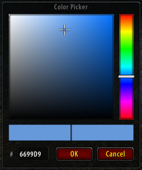

# TurtleColorPicker

Standalone HSV color picker library for [TurtleWoW](https://turtle-wow.org/) (WoW 1.12) addon developers.



## Features

- HSV saturation/value square + vertical hue bar
- Optional hex color input (`#RRGGBB`)
- Old/New color preview swatches
- Compact, draggable popup (ESC to close)
- Lazy initialization (no overhead until first use)
- Clean API with `onChange`, `onOk`, `onCancel` callbacks

## Installation

Download and extract into your `Interface/AddOns/` folder so the structure is:

```
Interface/AddOns/TurtleColorPicker/
  TurtleColorPicker.toc
  Core.lua
  UI.lua
```

## Integration

Add the dependency to your addon's `.toc` file:

```
## RequiredDeps: TurtleColorPicker
```

Then call the API from your addon:

```lua
TurtleColorPicker:Open({
    color = { r = 0.5, g = 0.8, b = 1.0 },  -- initial color (0-1)
    hasHexInput = true,                        -- show hex input field
    onChange = function(r, g, b)               -- fires during drag
        myFrame:SetBackdropColor(r, g, b, 1)
    end,
    onOk = function(r, g, b)                   -- fires on OK
        SaveColor(r, g, b)
    end,
    onCancel = function()                      -- fires on Cancel/ESC
        RevertColor()
    end,
})
```

All options are optional. Default color is white `(1, 1, 1)`.

## API Reference

### TurtleColorPicker:Open(opts)

Opens the color picker popup.

| Option | Type | Description |
|--------|------|-------------|
| `color` | `{r, g, b}` | Initial color, values 0-1. Default: white |
| `hasHexInput` | `boolean` | Show hex input field. Default: `false` |
| `onChange` | `function(r, g, b)` | Called on every color change during interaction |
| `onOk` | `function(r, g, b)` | Called when OK is clicked |
| `onCancel` | `function()` | Called when Cancel is clicked or ESC pressed |

### TurtleColorPicker:Close()

Programmatically closes the picker.

### Utility Functions

```lua
local r, g, b = TurtleColorPicker.HSVtoRGB(h, s, v)
local h, s, v = TurtleColorPicker.RGBtoHSV(r, g, b)
local hex     = TurtleColorPicker.RGBtoHex(r, g, b)   -- "FF8000"
local r, g, b = TurtleColorPicker.HexToRGB("FF8000")  -- returns 0-1
local clamped = TurtleColorPicker.Clamp(val, min, max)
```

## Example: Color Swatch Button

```lua
local swatch = CreateFrame("Button", nil, MyOptionsFrame)
swatch:SetWidth(20)
swatch:SetHeight(20)
swatch:RegisterForClicks("LeftButtonUp")

local tex = swatch:CreateTexture(nil, "BACKGROUND")
tex:SetAllPoints(swatch)
tex:SetTexture(MySettings.r, MySettings.g, MySettings.b)

swatch:SetScript("OnClick", function()
    TurtleColorPicker:Open({
        color = MySettings,
        hasHexInput = true,
        onChange = function(r, g, b)
            tex:SetTexture(r, g, b, 1)
        end,
        onOk = function(r, g, b)
            MySettings.r = r
            MySettings.g = g
            MySettings.b = b
        end,
        onCancel = function()
            tex:SetTexture(MySettings.r, MySettings.g, MySettings.b, 1)
        end,
    })
end)
```

## Test Commands

- `/tcp test` - Opens picker with hex input
- `/tcp minimal` - Opens picker without hex input
- `/tcp` - Shows version info

## License

MIT
